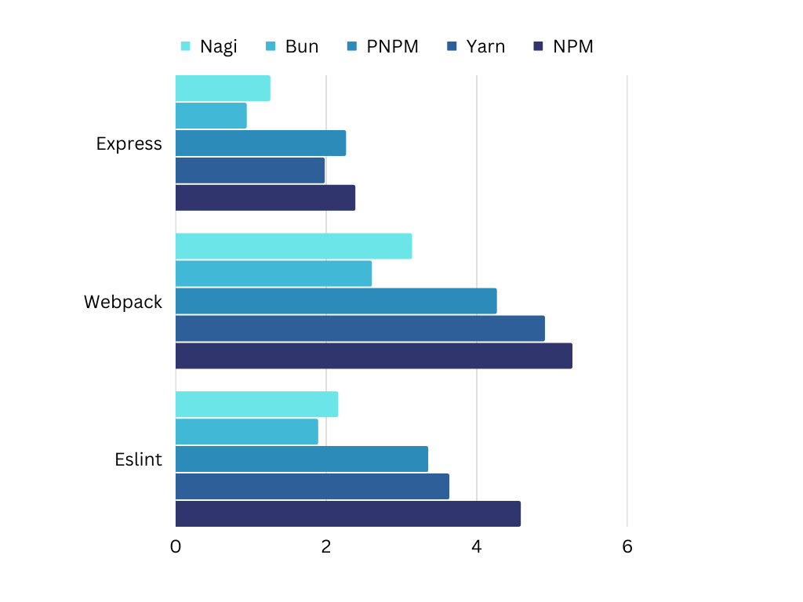

## Nagi (凪) - JavaScript package downloader written in Go [[日本語](./md/README.ja.md)]

### Features 

· minimum
· kind of fast
· command compatible with [NPM](https://www.npmjs.com)

### Installation

```bash
npm install nagi -g
```

### Usage

· installs packages from your package.json file

```bash
nagi install
```

· installs/uninstalls packages

```bash
nagi install lodash
nagi uninstall lodash
```

· for more, please refer to `nagi help` command

### FAQ

<details>
<summary>why is this fast?</summary>

· it mainly uses go which compiles to native code
· it uses parallels
· it creates symlinks instead of copying
</details>

<details>
<summary>why is this slow?</summary>
· this is my first go program
</details>

<details>
<summary>can't create symlinks on windows</summary>

· you may want to turn on the developer mode
```powershell
start ms-settings:developers
```
</details>

<details>
<summary>it was detected as malware/virus</summary>

· please refer to [Go FAQ](https://go.dev/doc/faq#virus)
</details>

### Benchmarks



· details: [benchmarks.md](./md/benchmarks.md)