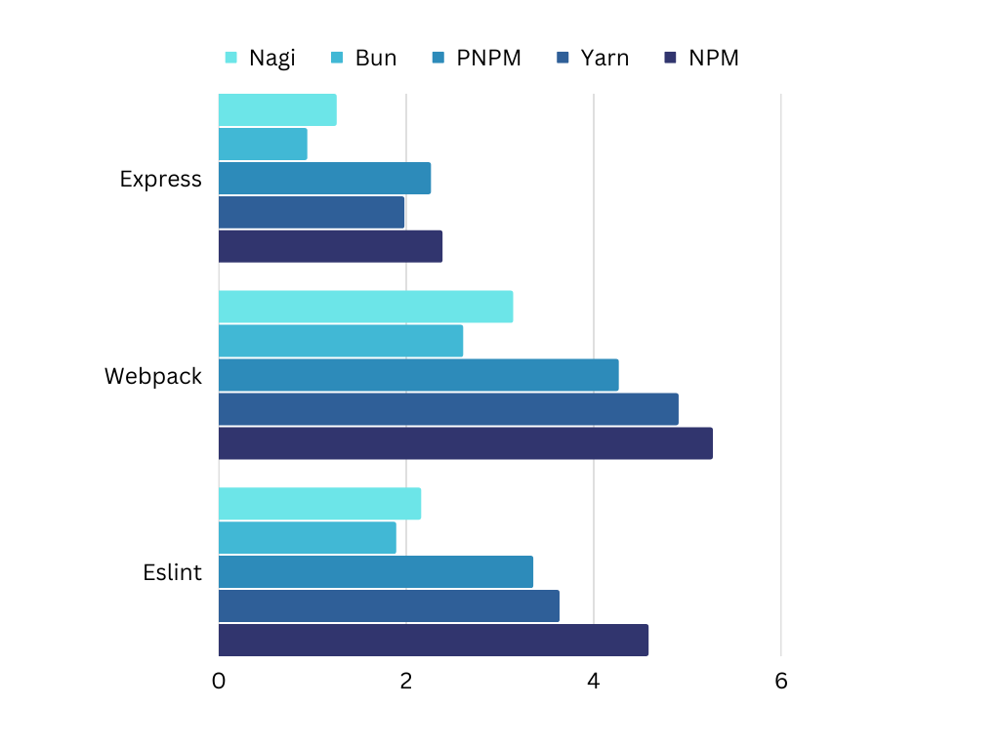

## 凪 - GoのJavaScriptパッケージダウンローダー

### 特徴 

· 必要最小限
· 速め
· コマンドに[NPM](https://www.npmjs.com)と互換性がある

### インストール

```bash
npm install nagi -g
```

### 使い方

· package.jsonからパッケージをインストール

```bash
nagi install
```

· パッケージをインストール／アンインストール

```bash
nagi install lodash
nagi uninstall lodash
```

· ほかは `nagi help` コマンドを参照してね

### FAQ

<details>
<summary>なぜ速いか</summary>

· Goをメインで使っている
· 並行して作業を行なっている
· ファイルのコピーの代わりにリンクを作成する
</details>

<details>
<summary>なぜ遅いか</summary>
· これが初めてのGoプログラム
</details>

<details>
<summary>windowsで（シンボリック）リンクが作れない</summary>

· 開発者モードをオンにすると使える場合が多い
```powershell
start ms-settings:developers
```
</details>

<details>
<summary>バイナリがウイルスとして検知される</summary>

· [GoのFAQ](https://go.dev/doc/faq#virus)を参考に
</details>

### ベンチマーク



· 詳細: [benchmarks.ja.md](./benchmarks.ja.md)